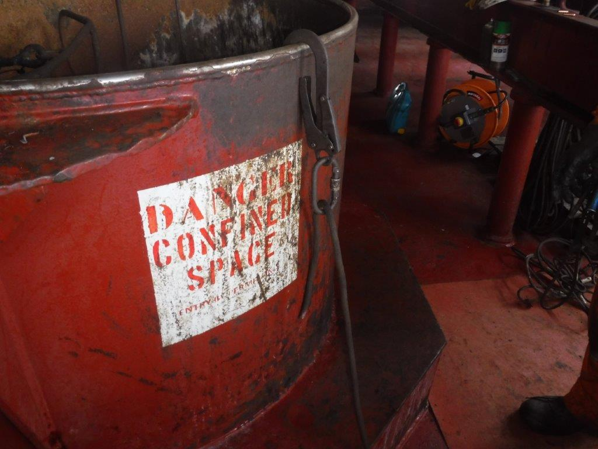

# Incubator Bootcamp-documents
## Project Outline
This Data Analysis project aims to generate into performance of transportatation over the year. By analysing the various parameter in the data received , we seek to gather enoughh insight to make reasonable decisions which then enables us to tell compelling stories around our data from the insight gotten an to know the performance of our Data.

## Data Sources
The primary source of Data used here is from kaggle [Here](www.Kaggle.com) Other Data sources are Fedral Reserve Economic Data[See Here](Fred.st.louisfed.org) and Google[Here](https://myaccount.google.com/data-and-privacy)

## Tools used
- Ms Excel[Download Here](https://www.microsoft.com/en-us/microsoft-365/excel)
- Mirosoft Power BI[download Here](https://www.microsoft.com/en-us/download/details.aspx?id=58494)
- Python[Download Here](https://www.python.org/downloads/)
- SQL[Download Here](https://microsoft.com/en-us/sql-server/sql-server-downloads)

 ## Project Overview
 
 --Input
``` INPUT
Google Query Sheet

SELECT * FROM TABLE I
WHERE CONDITION = MET

```





|Heading1| Heading2 |Heading3|
|--------|----------|--------|                 
|Data 1|Data 2|Data3|
